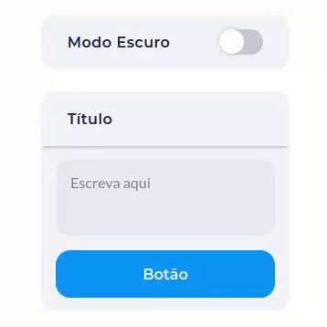

# Tema Escuro com Sass

Layout básico com opção de modo noturno construído com a ajuda de Sass e React.js.

Nesse repositório de exemplo, você encontra todos os detalhes relevantes em forma de comentários nos arquivos, assim como os slides e recursos adicionais em Markdown.

 

  

 

## Acesso

O deploy da aplicação ficará disponível no [Vercel](https://theming-sass.vercel.app/).

 

## Localmente

Antes de rodar a aplicação localmente, instale as dependências através de um CLI:

`yarn install`

Rode o comando abaixo para iniciar a aplicação:

`yarn dev`

 

## Tecnologias usadas

- [**ReactJS**](https://reactjs.org/) : Framework do JavaScript

- [**Vite**](https://vitejs.dev/) : Module bundler (alternativa ao [create-react-app](https://github.com/facebook/create-react-app))

- [**Sass**](https://sass-lang.com/) : Linguagem de estilo e pré-processador de CSS
